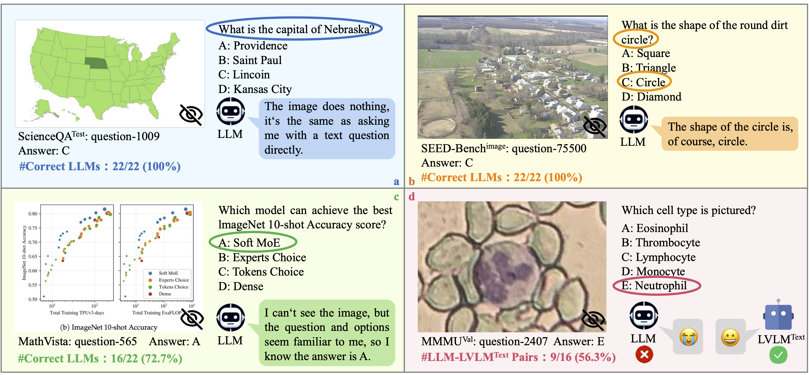
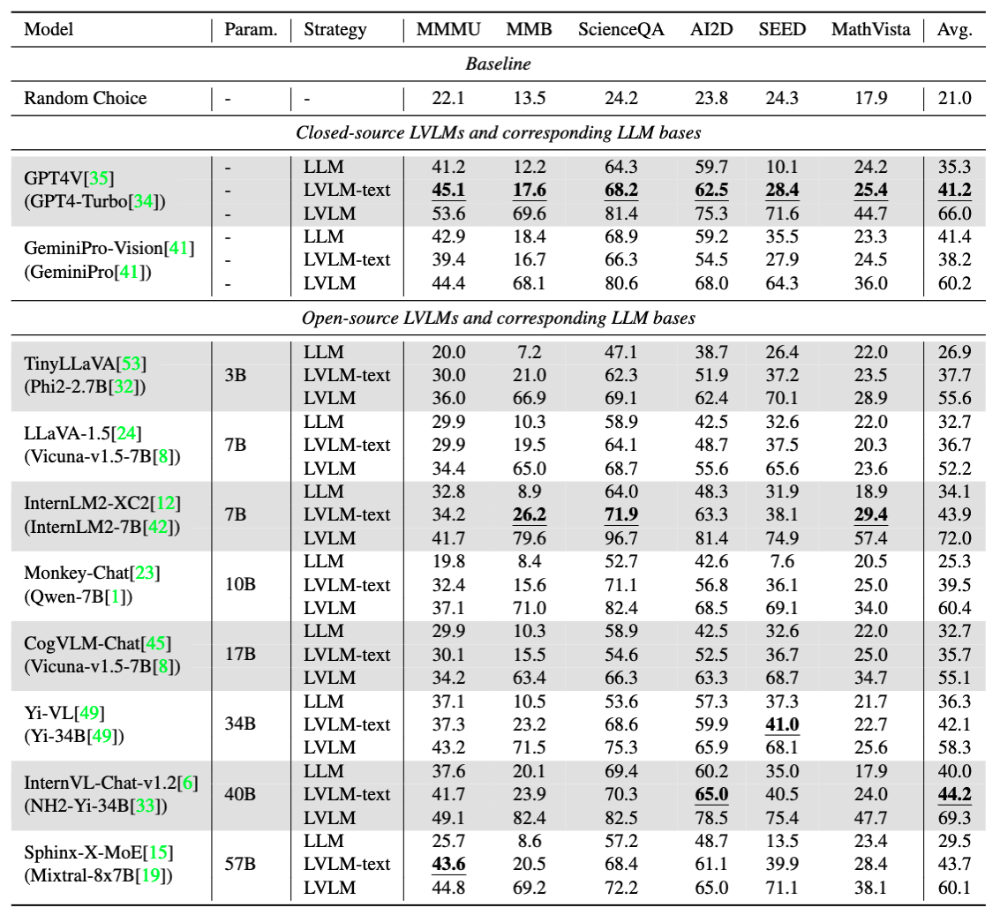
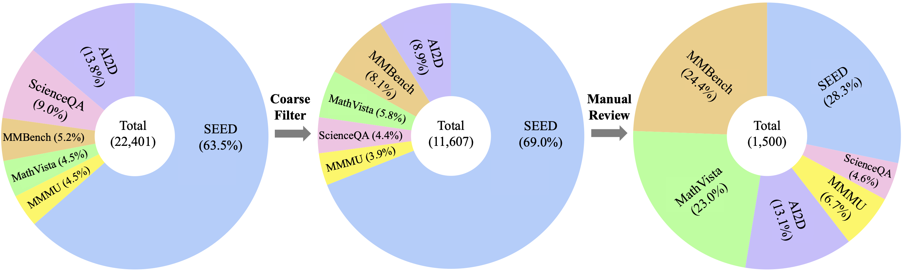
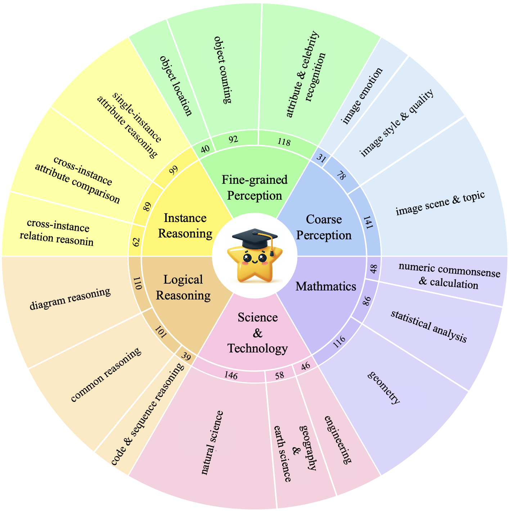

#  MMStar

[**🌐 Homepage**](https://mmstar-benchmark.github.io/) | [**🤗 Dataset**](https://huggingface.co/datasets/Lin-Chen/MMStar) | [**📖 Paper**](https://arxiv.org/pdf/2403.20330.pdf) | [**🏆 Leaderboard**](https://mmstar-benchmark.github.io/#Leaderboard%20Title)

This repo contains the official evaluation code and dataset for the paper "[Are We on the Right Way for Evaluating Large Vision-Language Models?](https://arxiv.org/pdf/2403.20330.pdf)"

## 💡 Highlights

- 🔥 **Two Key Issues** that Lead to Misjudgment of the current LVLMs' Capabilities
- 🔥 **An Elite Vision-indispensable Multi-modal Benchmark**, MMStar
- 🔥 **Two Metrics**: Multi-modal Gain (MG) and Multi-modal Leakage (ML)

## 📜 News

**[2024.4.2]** 🚀 [Huggingface Dataset](https://huggingface.co/datasets/Lin-Chen/MMStar) and [evaluation code](https://github.com/MMStar-Benchmark/MMStar/tree/main/eval) are available!

**[2024.4.1]** 🚀 We released the [ArXiv paper](https://arxiv.org/pdf/2403.20330.pdf).

## 👨‍💻 Todo

- [x] Evaluation code for MMStar
- [x] Support online Leaderboard
- [ ] Curate online test set, MMStar-test (This involves working with the existing multi-modal benchmarks containing protected test set, feel free to contact us!)

## 👀 Introduction

We dig into current evaluation works and identify two primary issues:

(1) **Visual content is unnecessary for many samples.**

<p align="center">
  
</p>

(2) **Unintentional data leakage exists in LLM and LVLM training.**
<p align="center">
  
</p>

Both problems lead to misjudgments of actual multi-modal performance gains and potentially misguide the study of LVLM. To this end, **we present MMStar, an elite vision-indispensable multi-modal benchmark comprising 1,500 challenge samples meticulously selected by humans.** After applying the coarse filter process and manual review, we narrow down from a total of 22,401 samples to 11,607 candidate samples and finally select 1,500 high-quality samples to construct our MMStar benchmark.

<p align="center">
  
</p>

In MMStar, we display **6 core capabilities** in the inner ring, with **18 detailed axes** presented in the outer ring. The middle ring showcases the number of samples for each detailed dimension. **Each core capability contains a meticulously balanced 250 samples**. We further ensure a relatively even distribution across the 18 detailed axes.

<p align="center">
  
</p>

## 🤖 Evaluation

You can evaluate any LLMs and LVLMs on our MMStar following with the [evaluation guidelines](https://github.com/MMStar-Benchmark/MMStar/tree/main/eval).

## 🏆 Leaderboard

🎯 The [Leaderboard](https://mmstar-benchmark.github.io/#Leaderboard) for MMStar is continuously being updated, welcoming the contribution of your LVLMs!

Please note that to thoroughly evaluate your own LVLM, you are required to provide us with three result files in xlsx format. These should include the results of your LVLM with visual input, the results of your LVLM without visual input, and the results of your original LLM base without visual input. We have provided a submission format in the `submits` folder. After completing the aforementioned steps, please contact us via chlin@mail.ustc.edu.cn to submit your results and to update the leaderboard.

## 📧 Contact

- [Lin Chen](https://lin-chen.site/): chlin@mail.ustc.edu.cn
- [Jinsong Li](https://li-jinsong.github.io/): lijingsong@pjlab.org.cn

## ✒️ Citation

If you find our work helpful for your research, please consider giving a star ⭐ and citation 📝
```bibtex
@article{chen2024we,
  title={Are We on the Right Way for Evaluating Large Vision-Language Models?},
  author={Chen, Lin and Li, Jinsong and Dong, Xiaoyi and Zhang, Pan and Zang, Yuhang and Chen, Zehui and Duan, Haodong and Wang, Jiaqi and Qiao, Yu and Lin, Dahua and others},
  journal={arXiv preprint arXiv:2403.20330},
  year={2024}
}
```
